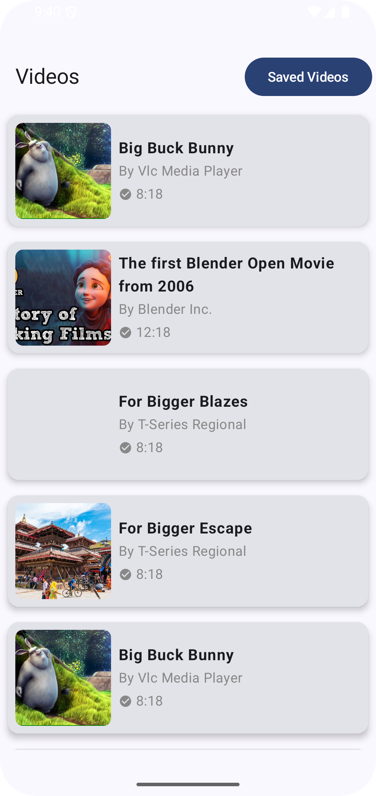
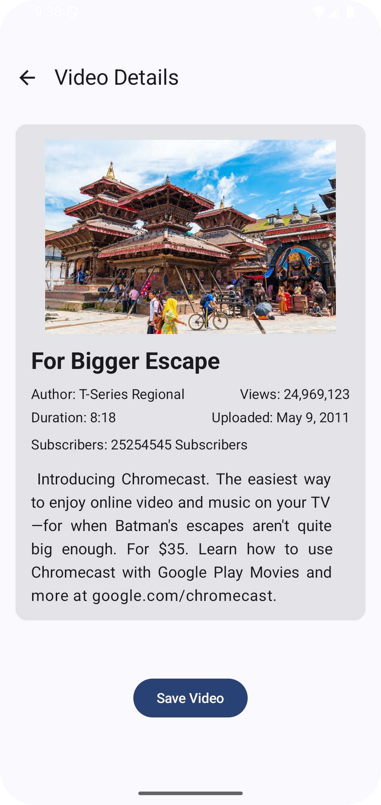
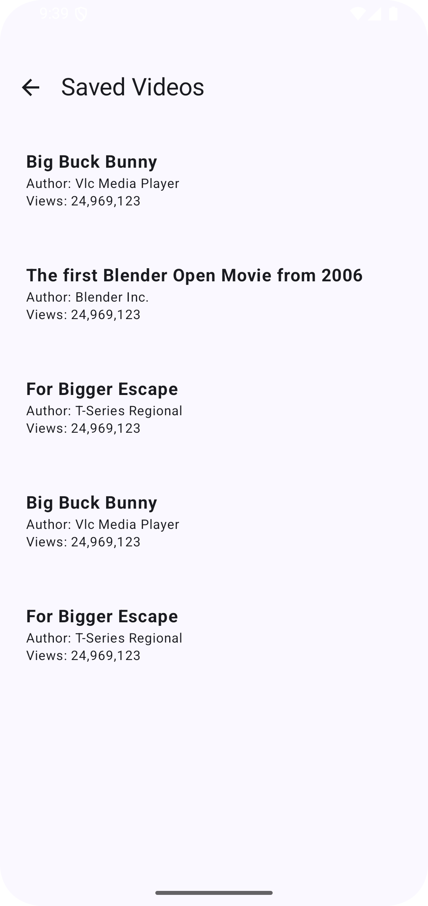

# Video Streaming App

## 📌 Overview
This is a simple **Video Streaming App** built using **Jetpack Compose**, **Room Database**, **Retrofit**, and **Hilt** for dependency injection. The app allows users to view a list of videos, check details of a selected video, and save videos to a local database for later viewing.

## 🎯 Features
- **Home Screen**: Displays a list of videos with **title, thumbnail, duration, and author**.
- **Video Detail Screen**: Shows complete details of a selected video, including a button to save it.
- **Saved Videos Screen**: Displays videos that have been saved to the local database.
- **Navigation**: Implemented using **Jetpack Compose Navigation**.
- **Image Loading**: Uses **Coil** for loading video thumbnails.
- **Local Storage**: Utilizes **Room Database** to store saved videos.

## 🛠️ Technologies Used
- **Jetpack Compose** (UI Framework)
- **Room Database** (Local Storage)
- **Retrofit** (API Calls)
- **Hilt** (Dependency Injection)
- **Coil** (Image Loading)
- **Jetpack Compose Navigation** (Navigation)
- **ViewModel & StateFlow** (MVVM Architecture)

## 📸 Screenshots
### Home Screen


### Video Detail Screen


### Saved Videos Screen


## 🚀 How to Run the Project
1. Clone this repository:
   ```sh
   git clone https://github.com/Asante-Adarkwa-Usman/training_assignment.git
   ```
2. Open the project in **Android Studio**.
3. Sync the project to install dependencies.
4. Run the app on an emulator or physical device.

## 📂 Project Structure
```
app/
│-- ui/
│   ├── screens/  # Home, Detail, and SavedVideo Screens
│   ├── widgets/  # Reusable UI Components
│-- data/
│   ├── api/      # Retrofit API Service
│   ├── db/       # Room Database & DAO
│   ├── model/    # Data Classes (VideoDetails, VideoEntity)
│-- di/           # Hilt Dependency Injection
│-- viewmodel/    # ViewModels for UI Logic
```

## ⚡ Functionality Breakdown
### 📌 Home Screen
- Fetches video list from the API using **Retrofit**.
- Displays video **title, thumbnail, duration, and author** in a **LazyColumn**.
- Clicking a video navigates to the **Video Detail Screen**.

### 📌 Video Detail Screen
- Displays **all video details** (title, description, author, views, duration, thumbnail, etc.).
- Clicking the **Save Video** button stores the video in **Room Database**.

### 📌 Saved Videos Screen
- Retrieves **saved videos** from **Room Database**.
- Displays them in a **LazyColumn**.

## ✅ Grading Criteria
- **Navigation**: Implemented using **Compose Navigation**.
- **ViewModel Usage**: Manages state efficiently with **StateFlow**.
- **Room Database Implementation**: Videos are stored and retrieved properly.
- **Compose UI**: Clean and responsive UI using **Jetpack Compose**.
- **App Runs Successfully**.

## 📜 License
This project is open-source and available for modification and learning.

